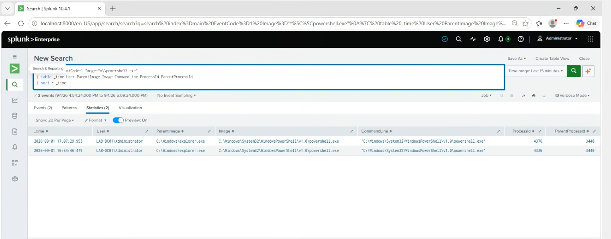

# Detect PowerShell Execution

## Purpose

The goal of this search is to find whenever PowerShell is launched on the Windows Server.

PowerShell is a normal Windows tool and is often used by system administrators. However, attackers can also use PowerShell to run commands, execute scripts, or download files, so I wanted to be able to see when it is being used.

## Data Source

- Sysmon
- Event ID 1 - Process Creation

Sysmon Event ID 1 is created whenever a new process starts on the system.

## SPL Query

```spl
index=main EventCode=1 Image="*\\powershell.exe"
| table _time User ParentImage Image CommandLine ProcessId ParentProcessId
| sort - _time
```

## What I Tested / Result

The search returned two PowerShell process creation events. The results showed the user, parent process, command line, process ID, and parent process ID.

## Screenshot


