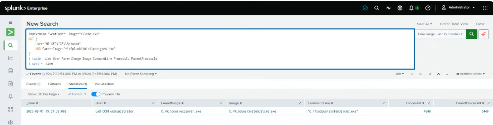

# Detect Command Prompt Execution

## Purpose

The goal of this search is to find when Command Prompt (`cmd.exe`) is launched on the Windows Server.

Command Prompt is a normal Windows tool, but attackers can also use it to run commands and interact with a system. Because of that, I wanted to be able to see when it starts and what launched it.

## Data Source

- Sysmon
- Event ID 1 - Process Creation

Sysmon Event ID 1 is created whenever a new process starts on the system.

## SPL Query

```spl
index=main EventCode=1 Image="*\\cmd.exe"
NOT (
    User="NT SERVICE\\Splunkd"
    AND ParentImage="*\\Splunk\\bin\\postgres.exe"
)
| table _time User ParentImage Image CommandLine ProcessId ParentProcessId
| sort - _time
```

## What I Tested / Result

The search returned one `cmd.exe` process creation event. The result showed `explorer.exe` as the parent process and the Administrator user.

## Screenshot


