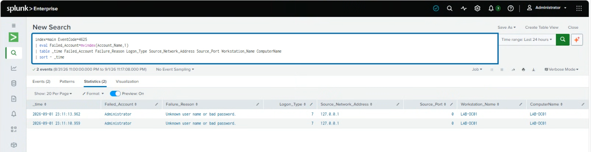

# Detect Failed Logon

## Purpose

The goal of this search is to find failed Windows logon attempts on the Windows Server.

Failed logons can happen normally when someone types the wrong password, but repeated failed attempts can also be a sign of password guessing, brute-force activity, or someone trying to access an account they should not be using.

## Data Source

- Windows Security Event Log
- Event ID 4625 - Failed Logon

Windows Security Event ID 4625 is created when a logon attempt fails.

## SPL Query

```spl
index=main EventCode=4625
| eval Failed_Account=mvindex(Account_Name,1)
| table _time Failed_Account Failure_Reason Logon_Type Source_Network_Address Source_Port Workstation_Name ComputerName
| sort - _time
```

## What I Tested / Result

The search returned two failed logon events for the Administrator account. Both events showed Logon Type 7 and the source network address `127.0.0.1`.

## Screenshot


