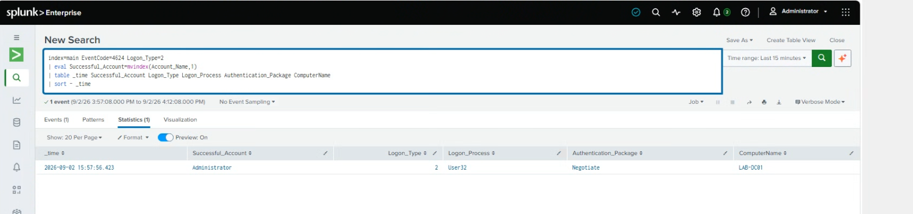

# Detect Successful Logon

## Purpose

The goal of this search is to find successful local logons on the Windows Server.

Successful logons are normal activity, but they can also be useful during an investigation. For example, a successful login after several failed attempts could be worth looking into.

## Data Source

- Windows Security Event Log
- Event ID 4624 - Successful Logon

Windows Security Event ID 4624 is created when an account successfully logs into the system.

## SPL Query

```spl
index=main EventCode=4624 Logon_Type=2
| eval Successful_Account=mvindex(Account_Name,1)
| table _time Successful_Account Logon_Type Logon_Process Authentication_Package ComputerName
| sort - _time
```

## What I Tested / Result

The search returned one successful logon event for the Administrator account. The result showed Logon Type 2, `User32` as the logon process, and `Negotiate` as the authentication package.

## Screenshot

